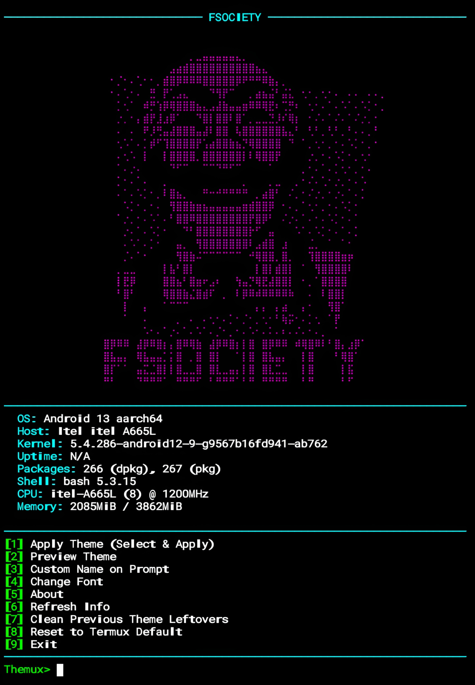

# Themux


<p align="center">
  <strong>Termux Theme Changer v5.5 – Cyberpunk Neon Edition</strong><br>
  <em>"Style your terminal. Express yourself." – Mr.X</em>
</p>

## Introduction
Themux is a powerful theme changer for **Termux (Android)** that lets you customize your terminal with stunning **ASCII art banners**, **modern command prompts**, and **custom fonts**—all without root. With **31 unique themes**, 20 downloadable fonts, system info display, and the ability to set a custom username on the prompt, Themux transforms your terminal into a cyberpunk masterpiece. It also includes cleanup tools to remove leftovers and restore Termux to its default state.

## Installation
```bash
$ pkg update -y && pkg upgrade -y
$ pkg install git python -y
$ git clone https://github.com/Whomrx666/Themux.git
$ cd Themux
$ python3 install.py
```

## Run manually
```bash
$ python3 themux.py
```

## Features
- **31 Unique Themes** – Each theme combines a logo (ASCII art) with a matching prompt style.
- **ASCII Art Logos** – Choose from anime girls, hackers, skulls, Linux distros, and more.
- **Custom Prompt** – Set a custom name to replace the username in the prompt.
- **20 Fonts** – Download and apply popular monospace fonts.
- **System Info Display** – Shows OS, host, kernel, uptime, packages, CPU, memory.
- **Cleanup Tools** – Remove leftover theme files and MOTD.
- **Reset to Default** – Restore original Termux appearance.
- **Auto-apply on new session** – Banner and prompt persist after restart.
- **Cyberpunk UI** – Neon colors, centered banners, loading screens.
- **No Root Required** – Works entirely within Termux.

## Menu Options
| #  | Option | Description |
|----|--------|-------------|
| 1  | Apply Theme | Select and apply a theme (banner + prompt) |
| 2  | Preview Theme | Preview a theme before applying |
| 3  | Custom Name on Prompt | Replace `\u` with a custom name |
| 4  | Change Font | Download and apply a font |
| 5  | About | Information about Themux |
| 6  | Refresh Info | Update system info display |
| 7  | Clean Previous Theme Leftovers | Remove old theme files and MOTD |
| 8  | Reset to Termux Default | Restore original settings |
| 9  | Exit | Quit the program |

## Instructions
1. **Install** the tool using the commands above.
2. **Run** `python3 themux.py` to start.
3. **Apply a theme** – Choose option `1`, select a theme number, and it will be applied immediately.
4. **Preview a theme** – Choose option `2` to see how a theme looks before applying.
5. **Set custom name** – Use option `3` to replace your username in the prompt (supports reset).
6. **Change font** – Use option `4` to download and apply a font (requires internet).
7. **Clean leftovers** – Use option `7` to remove old theme files if you encounter issues.
8. **Reset** – Use option `8` to restore Termux to its default state.
9. **Exit** – Use option `9` or press `Ctrl+C` (graceful exit).

## Observation
This tool is intended for **personal customization and educational purposes only**. It modifies Termux configuration files (like `.bashrc`, `.termux/`), so always ensure you have a backup if needed. The author is not responsible for any issues arising from misuse. Use at your own risk.

### Original Author
<a href="https://github.com/Whomrx666"></a>

### <<< If you copy, then give me the credits >>>

## CONNECT WITH ME :

[](https://whomrx.pages.dev)<br>
[](https://whomrxhackers.blogspot.com)<br>
[](https://twitter.com/whomrx666)<br>
[](https://wa.me/6285926601133?text=Halo%2C%20Mr.X)<br>
[](https://www.facebook.com/whomrx.666)<br>
[](https://t.me/Whomr_X)<br>
[](mailto:whomrx666@gmail.com)<br>
[](https://www.tiktok.com/@whomr.x)

<br>

**If you want to donate, click on the button**<br>
<a href="https://saweria.co/whomrx"></a>

---

<p align="left">
  
</p>